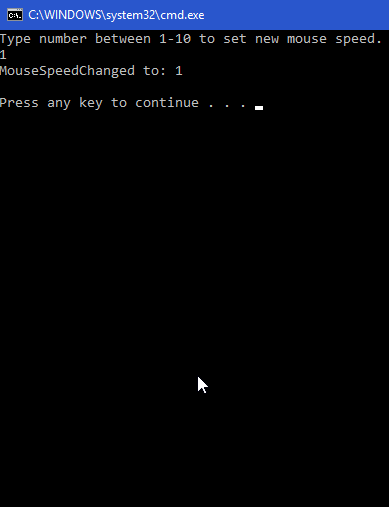

# Mouse Speed Changer
 Konzolová aplikace, která pomocí Win32 API mění citlivost myši.

Windows User je komponenta, která zajišťuje např. vytváření a správu UI vč. ovládání myši. V OS je reprezentována knihovnou User32.dll. 

Z C# je možné User32.dll používat díky importu a změny nastavení:
```csharp
[DllImport("User32.dll")]

// Změna nastavení
SystemParametersInfo(params);
```
---

Aplikace měnící nastavení myši se skládá z částí:
* MouseSettingsChangerClient -> .Net Core konzolová aplikace
* MouseSettingsChangerLib -> .Net Standard knihovna ovládající User32.dll



## Použití
**Klientská čásť**:
1) Přidat referenci na knihovnu MouseSettingsChangerLib do projektu
```csharp
using MouseSettingsChangerLib;
```
2) Zavolat metodu **Changer.ChangeMouseSpeed(nová hodnota)** odkudkoliv z projektu

```csharp
// new mouse speed value
UInt32 mouseSpeed = 5;

// change sensitivity
Changer.ChangeMouseSpeed(mouseSpeed); 
```

# Volání WinAPI
Pro změnu citlivosti myši je potřeba importovat (pInvoke) knihovnu User32.dll a připravit si _SystemParametersInfo_.
## Změna citlivosti myši

```csharp
// Settings to change (key)
private const UInt32 SpiSetmousespeed = 0x0071;

// Win32 Api library import
[DllImport("User32.dll")]
static extern Boolean SystemParametersInfo(
    UInt32 uiAction,
    UInt32 uiParam,
    UInt32 pvParam,
    UInt32 fWinIni);

// Api call -> change mouse sens. to a new value
SystemParametersInfo(
    SpiSetmousespeed
    ,0
    ,MouseSpeed
    ,0);
}
```
# Získání hodnoty citlivosti myši
Menší úprava oproti změně hodnoty cistlivosti myši je v parametru __pvParam__, kam se je přidáno __ref__.
```csharp
// Settings (key)
private const UInt32 SpiGetmousespeed = 0x0070;

[DllImport("User32.dll")]
static extern Boolean SystemParametersInfo(
    UInt32 uiAction,
    UInt32 uiParam,
    ref UInt32 pvParam,
    UInt32 fWinIni);

// Api call -> get mouse sensitivity
UInt32 mouseSpeed = 0;
SystemParametersInfo(
    SpiGetmousespeed
    , 0
    , ref mouseSpeed
    , 0);
return mouseSpeed;
}
```
MS Dokumentace k **[SystemParametersInfo](https://msdn.microsoft.com/en-us/library/ms724947.aspx)**, kde lze nalézt další klíče k nastavením.